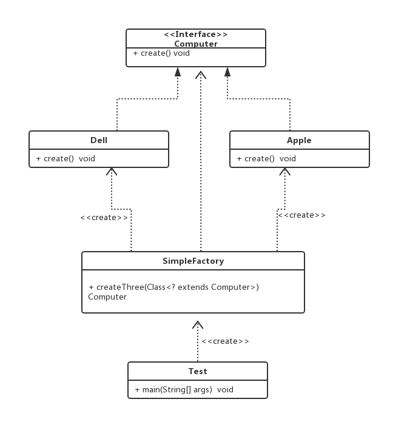
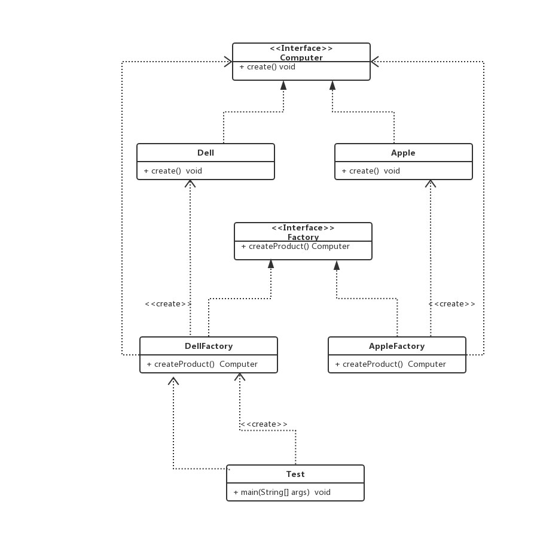
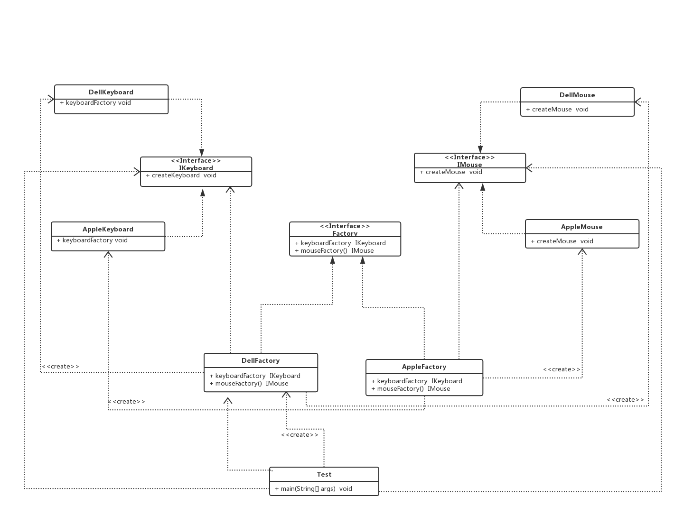

#工厂模式

> 1、用UML绘制出三种工厂模式的类结构图。

## 一、简单工厂模式 类图
  
## 二、工厂方法模式 类图
  
## 三、抽象工厂模式 类图
  
> 2、深刻理解产品族和产品等级结构之间的关系。

> 3、自主完成三种工厂模式的代码实现，理解简单工厂、工厂方法和抽象工厂的区别。
###### 简单工厂：
简单工厂:根据外界的信息，由一个工厂对象决定创建哪一种产品类的示例。
适用场景：适用于工厂类负责创建的对象较少的场景，而且客户端只需要传入工厂类的参数，对于如何创建对象的逻辑不需要关心。

###### 工厂方法：
工厂方法模式：定义一个创建对象的接口，但让实现这个接口的类来决定实例化那个类，工厂方法让类的实例化推迟到子类中进行。
适用场景：创建对象需要大量重复的代码、客户端不需要知道创建对象的细节
缺点：类的个数容易多，增加复杂度，增加了系统的抽象性和理解难度

###### 抽象工厂：
抽象工厂模式：提供一个创建一系列相关或相互依赖的对象接口，无需指定他们具体的类。

